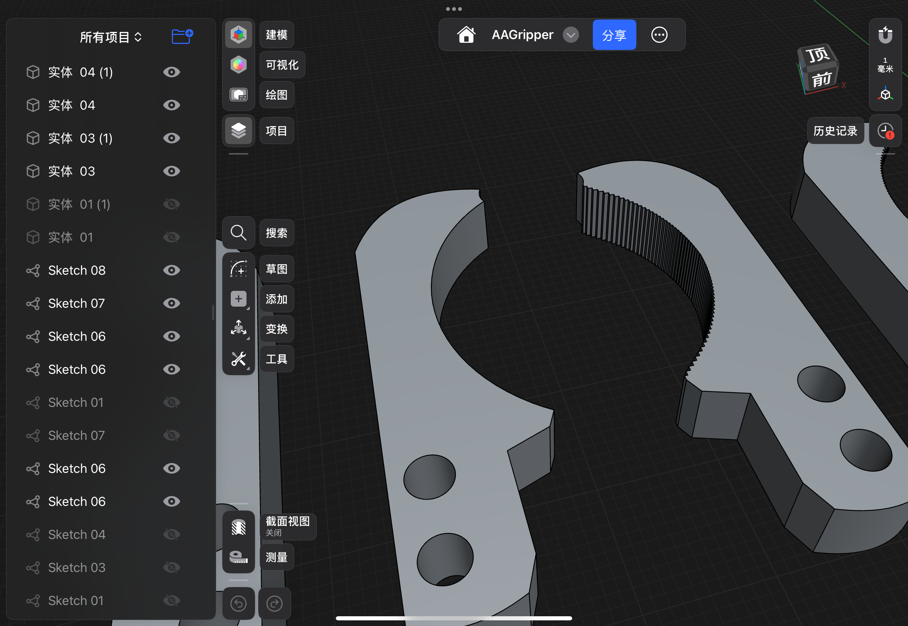
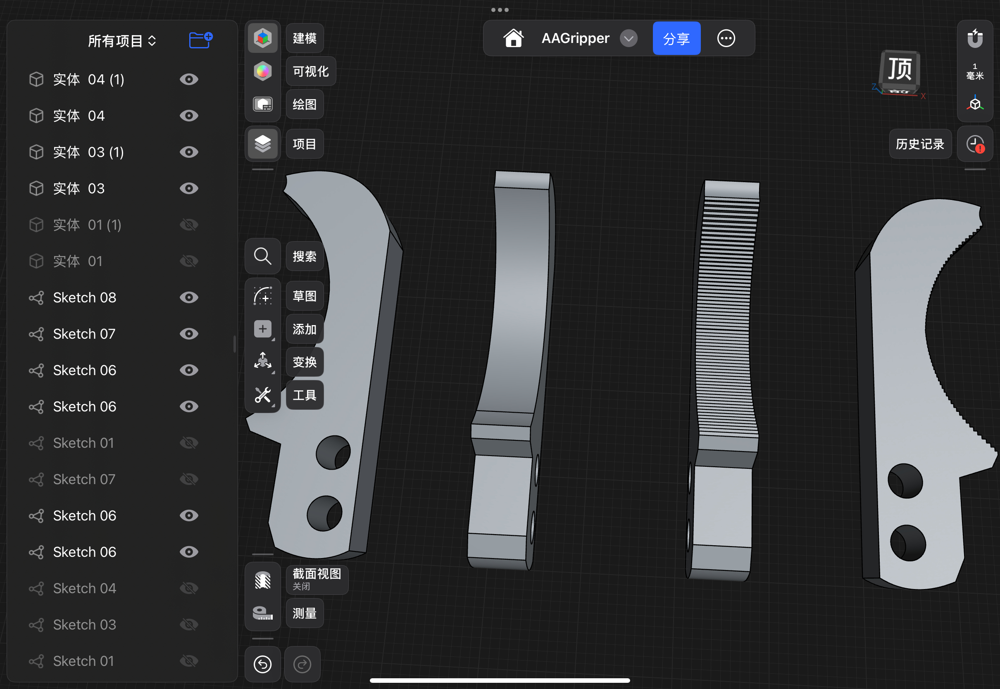

# 末端执行器结构设计与自动化抓取系统
## End-Effector Gripper Design & Automated Pick-and-Place System

> **课程 / Course**：AAE2103 / IC2117 Applied Engineering Fundamentals
> **学校 / Institution**：The Hong Kong Polytechnic University 香港理工大学
> **时间 / Period**：Sep 2025 – Nov 2025
> **项目类型 / Type**：Individual Project（个人独立项目）
> **作者 / Author**：He Youbin (贺宥斌)

---

## 项目简介 / Overview

针对瓶盖抓取任务，独立完成了一个完整的末端执行器（end-effector）结构设计与自动化系统集成项目。覆盖**问题分析 → 文献调研 → 机械结构设计 → 3D 打印原型 → Arduino 嵌入式控制 → 自动化抓取测试 → 工程复盘**的全流程。

This project independently delivers a complete end-effector design and automated pick-and-place system for bottle cap manipulation tasks, covering problem analysis, mechanism design, 3D-printed prototyping, Arduino-based embedded control, automated grasping tests, and engineering reflection.

---

## 关键成果 / Key Achievements

| 指标 | 结果 |
|---|---|
| 适配瓶盖直径 | **19 – 26 mm** |
| 抓取成功率 | **100%**（在临界速度参数下） |
| 连续运行 | **1 分钟 零失误** |
| 结构迭代 | **V1 锯齿版 + V2 光面版** 两套方案对照实验 |
| 控制临界点 | speed / acceleration = **1000** 单位 |

---

## 技术栈 / Tech Stack

| 模块 | 工具 / 平台 |
|---|---|
| CAD 设计 | Shapr3D |
| 3D 打印 | Bambu Lab X1-Carbon, PLA |
| 嵌入式控制 | Arduino + AccelStepper 库 |
| 机械系统 | X-Y Table（步进电机）+ Servo 伺服电机 |

---

## 系统架构 / System Overview


整套系统由 X-Y Table（双轴步进电机驱动）+ 3D 打印末端执行器 + Servo 伺服电机（控制夹爪开合）+ Arduino 主控板组成；在限位平台上完成"取-搬-放"全自动闭合循环。

---

## 结构设计与迭代 / Design & Iteration

### V1（锯齿版）vs V2（光面版）



- **V1（带锯齿版）**：内弧加锯齿凸起，针对带竖向纹路的瓶盖，通过机械咬合提升摩擦
- **V2（光面版）**：利用 3D 打印 FDM 工艺天然形成的横向层纹提供摩擦，针对光面瓶盖

### 多版本迭代历程



夹爪曲率、长度、前端凹槽结构经过多轮参数化迭代：

- **曲率优化**：适配 19–26 mm 直径范围内不同瓶盖
- **长度延伸**：避免覆盖不全导致脱出
- **前端凹槽**：防止伺服张开瞬间将瓶盖反向推出（关键 DFM 改进）

---

## 控制逻辑 / Control Logic

6 步顺序控制状态机：

```
伺服张开 → X 轴定位 → Y 轴下降 → 伺服夹紧 → X 轴搬运 → Y 轴下降 → 伺服张开（释放）
```

关键代码片段：

```cpp
#include <AccelStepper.h>

stepperX.setMaxSpeed(1000);
stepperX.setAcceleration(1000);
stepperX.setCurrentPosition(0);
stepperY.setMaxSpeed(1000);
stepperY.setAcceleration(1000);
stepperY.setCurrentPosition(0);

// 取放坐标
moveToXY(-127, 80);
```

完整代码见 [`code/`](./code/) 目录。

---

## 测试与结果 / Testing & Results


通过对速度 / 加速度参数的系统化扫描，发现 **1000 单位**为保证抓取成功率的临界值：

- 低于 1000：抓取稳定但效率不高
- **= 1000**：100% 成功率，1 分钟连续运行零失误 ✓
- 高于 1000：夹爪在快速下降中将瓶盖反向推开，成功率显著下降

测试环境：表面平整的塑料板 + 限位卡槽，避免电机振动导致整机滑移。

---

## 工程反思 / Engineering Reflection

从 5 个维度完成项目复盘：

1. **材料-表面交互**：锯齿提升摩擦的实证 + 3D 打印层纹的意外利用
2. **机械结构**：曲率、长度、前端凹槽的多轮参数化迭代
3. **控制系统**：6 步顺序控制 + 临界参数搜索方法
4. **任务对象**：两版夹爪对应不同瓶盖表面纹理
5. **环境条件**：测试平台稳定化（限位卡槽 + 清空工作区）

### 后续改进方向 / Future Improvements

- **加装视觉/力传感器**实现闭环位置控制与抓力反馈
- **优化运动控制算法**（梯形速度规划、闭环位置控制）
- **复合摩擦材料**（在接触面贴合海绵或橡胶层，进一步提升摩擦适配性）
- **轻量化材料**：替换更轻的打印材料以提升运动稳定性

---

## 仓库结构 / Repository Structure

```
.
├── README.md           本说明文件
├── cad/                Shapr3D 模型 + STL 导出文件
├── code/               Arduino 控制代码
├── photos/             项目过程照片与最终成果图
├── video/              运行演示视频（可选）
└── docs/               Worksheet 1 & 2（脱敏版，供参考）
```

---

## 联系方式 / Contact

**He Youbin (贺宥斌)**
Aerospace Engineering, The Hong Kong Polytechnic University
Email：18774878768@163.com
